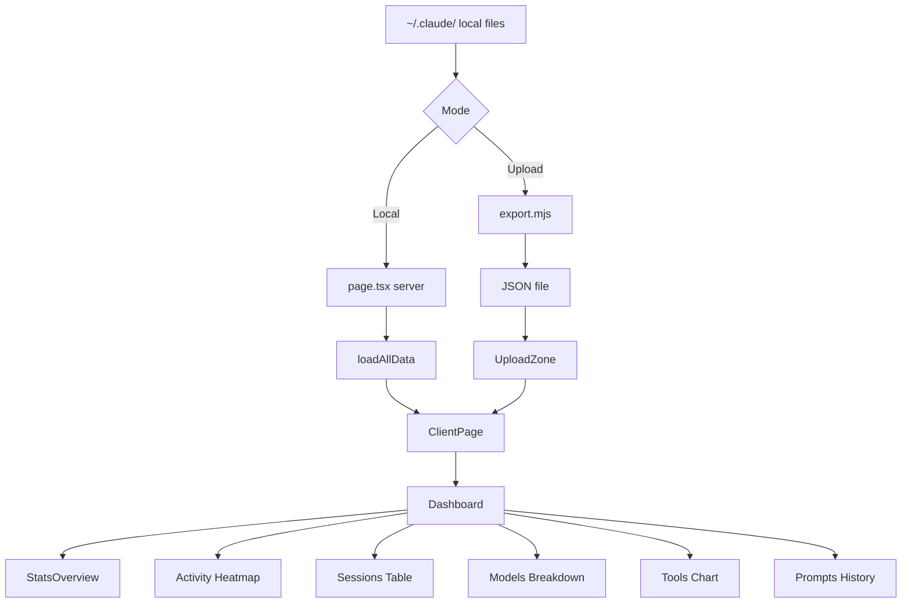

## Overview

Claude Analytics is a Next.js 16 application that visualizes usage data from Claude Code's local `~/.claude/` directory. The application operates in two distinct modes:

<CardGroup cols={2}>
  <Card title="Local Mode" icon="server">
    Server component reads `~/.claude/` directly via Node.js `fs` module and passes data to client components
  </Card>
  <Card title="Upload Mode" icon="upload">
    User exports data with `scripts/export.mjs`, then uploads the JSON file. All processing happens client-side in the browser
  </Card>
</CardGroup>

<Note>
  **Privacy First**: No data is ever sent to external servers. There is no database. All analytics processing happens locally or in your browser.
</Note>

## Data Flow Architecture



### Component Flow

1. **Data Loading Layer** (`src/app/page.tsx`)
   - Server-side component that calls `loadAllData()` from `src/lib/load-data.ts`
   - Reads all necessary files from `~/.claude/` directory
   - Passes initial data to client components

2. **State Management Layer** (`ClientPage`)
   - Manages multi-profile state
   - Handles file uploads and profile switching
   - Renders either `UploadZone` or `Dashboard`

3. **Presentation Layer** (`Dashboard` + child components)
   - Project filtering and tab navigation
   - Data visualization components
   - Interactive charts and tables

## Key Architecture Decisions

### Client-Side Rendering

All UI components use `"use client"` directive. The server component (`page.tsx`) only reads files from disk — all chart rendering and interaction happens client-side.

**Benefits:**
- Works as a static export with uploaded files
- Full interactivity without server round-trips
- Seamless transition between local and upload modes

```tsx title="src/app/page.tsx"
import { loadAllData } from "@/lib/load-data";
import { ClientPage } from "@/components/client-page";

export const dynamic = "force-dynamic";

export default function Home() {
  const data = loadAllData();
  const hasData = data.stats !== null || data.sessions.length > 0;

  return <ClientPage initialData={hasData ? data : null} />;
}
```

### Multi-Profile State Management

`ClientPage` manages an array of `Profile` objects, each containing:

<ParamField path="id" type="string">
  Unique identifier for the profile
</ParamField>

<ParamField path="name" type="string">
  Display name ("Local" or generated from account UUID)
</ParamField>

<ParamField path="data" type="DashboardData">
  Complete analytics data for the profile
</ParamField>

Profiles are **additive** — uploading a new file doesn't replace existing profiles, allowing comparison between different exports or accounts.

```tsx title="Profile Structure"
interface Profile {
  id: string;
  name: string;
  data: DashboardData;
}
```

### Project Filtering Strategy

`Dashboard` component extracts unique `project_path` values from sessions and provides a dropdown filter:

- **Filtered**: `sessions` and `history` arrays are filtered by selected project
- **Unfiltered**: Stats, heatmap, and hour chart remain unfiltered because they use pre-aggregated data from `stats-cache.json` that can't be split by project

```tsx title="Project Filtering Logic"
const filteredSessions = useMemo(
  () =>
    selectedProject === "all"
      ? data.sessions
      : data.sessions.filter((s) => s.project_path === selectedProject),
  [data.sessions, selectedProject]
);
```

## Next.js App Router Structure

<Accordion title="Directory Layout">
  ```
  src/
  ├── app/                    # Next.js App Router
  │   ├── layout.tsx          # Root HTML shell (fonts, dark class)
  │   ├── page.tsx            # Server entry: loads data, renders ClientPage
  │   ├── globals.css         # Tailwind + neomorphic theme
  │   └── api/
  │       └── session-messages/
  │           └── route.ts    # GET endpoint for full session transcripts
  ├── components/
  │   ├── client-page.tsx     # Profile management, upload/dashboard toggle
  │   ├── dashboard.tsx       # Tab layout, project filter, profile switcher
  │   ├── upload-zone.tsx     # File upload UI with instructions
  │   ├── stats-overview.tsx  # 7 stat cards
  │   ├── activity-heatmap.tsx
  │   ├── hour-chart.tsx
  │   ├── project-breakdown.tsx
  │   ├── daily-tokens-chart.tsx
  │   ├── model-breakdown.tsx
  │   ├── session-table.tsx
  │   ├── tool-usage-chart.tsx
  │   ├── prompt-history.tsx
  │   └── ui/                 # shadcn primitives
  ├── lib/
  │   ├── types.ts            # All TypeScript interfaces
  │   ├── utils.ts            # cn(), formatTokens(), etc.
  │   └── load-data.ts        # Server-side fs readers
  ```
</Accordion>

### Root Layout

The root layout (`src/app/layout.tsx`) establishes:

- **Font Stack**: Geist Sans + Geist Mono from `next/font/google`
- **Dark Mode**: `<html className="dark">` for persistent dark theme
- **Metadata**: Title and description for SEO

```tsx title="src/app/layout.tsx" {26}
export default function RootLayout({
  children,
}: Readonly<{
  children: React.ReactNode;
}>) {
  return (
    <html lang="en" className="dark">
      <body
        className={`${geistSans.variable} ${geistMono.variable} antialiased`}
      >
        {children}
      </body>
    </html>
  );
}
```

## API Routes

### Session Messages Endpoint

<Card title="GET /api/session-messages" icon="code">
  Fetches full conversation transcript for a specific session
</Card>

**Query Parameters:**

<ParamField query="session_id" type="string" required>
  The unique session identifier
</ParamField>

<ParamField query="project_path" type="string" required>
  Absolute path to the project directory
</ParamField>

**Response:**

```json
{
  "messages": [
    {
      "role": "user",
      "text": "Help me refactor this component",
      "timestamp": "2026-03-04T10:30:00Z",
      "toolUse": null
    },
    {
      "role": "assistant",
      "text": "I'll help you refactor that component...",
      "timestamp": "2026-03-04T10:30:05Z",
      "toolUse": [
        { "name": "Read", "id": "toolu_123" },
        { "name": "Edit", "id": "toolu_456" }
      ]
    }
  ]
}
```

<Note>
  This endpoint only works in **local mode** — it requires filesystem access to `~/.claude/projects/`
</Note>

**Implementation Details:**

```tsx title="src/app/api/session-messages/route.ts"
const encoded = projectPath.replace(/\//g, "-");
const jsonlPath = path.join(CLAUDE_DIR, "projects", encoded, `${sessionId}.jsonl`);

// Deduplicate by uuid (assistant messages can span multiple lines)
const uuid = entry.uuid;
if (uuid && seen.has(uuid)) continue;
if (uuid) seen.add(uuid);
```

## Design Philosophy

### Neomorphic Dark Theme

The application uses a custom neomorphic design system defined in `globals.css`:

- **Base Background**: `#0a0a0a` (near-black)
- **Card Background**: `#1a1a1a` with subtle inner shadows
- **Borders**: White with 5-10% opacity
- **Text Hierarchy**: White → Gray 200 → Gray 400 → Gray 600

All shadcn components are styled via `[data-slot="..."]` selectors with consistent neomorphic shadows.

### Performance Considerations

<AccordionGroup>
  <Accordion title="Chart Rendering">
    Uses Recharts library with responsive containers. All charts are client-rendered for interactivity.
  </Accordion>
  
  <Accordion title="Data Filtering">
    Uses React `useMemo` to prevent unnecessary recalculations during project filtering.
  </Accordion>
  
  <Accordion title="Session Expansion">
    Fetches message transcripts on-demand via API route only when user expands a session.
  </Accordion>
  
  <Accordion title="Prompt History">
    Limits display to first 200 prompts to prevent rendering slowdown.
  </Accordion>
</AccordionGroup>

## Technology Stack

<CardGroup cols={2}>
  <Card title="Next.js 16" icon="react">
    App Router framework with server/client components
  </Card>
  <Card title="React 19" icon="atom">
    UI library with modern hooks
  </Card>
  <Card title="Recharts" icon="chart-line">
    Area, Bar, and Pie charts
  </Card>
  <Card title="Radix UI" icon="layer-group">
    Headless primitives (Tabs, Select, ScrollArea)
  </Card>
  <Card title="Tailwind CSS 4" icon="paintbrush">
    Utility-first styling
  </Card>
  <Card title="TypeScript" icon="code">
    Type-safe development
  </Card>
  <Card title="Lucide React" icon="icons">
    Icon system
  </Card>
  <Card title="date-fns" icon="calendar">
    Date formatting utilities
  </Card>
</CardGroup>

## Security & Privacy

<Warning>
  The application **never transmits data** to external servers. All processing happens:
  - **Server-side**: Reading local `~/.claude/` files (local mode)
  - **Client-side**: Processing uploaded JSON files (upload mode)
</Warning>

No analytics, tracking, or telemetry is included. Your Claude Code usage data stays entirely on your machine or in your browser memory.