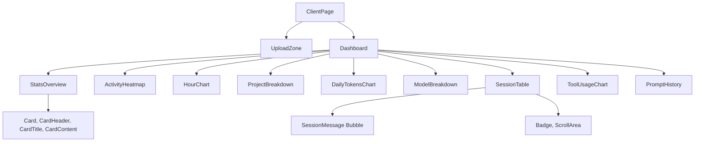

## Overview

All components are client-side (`"use client"`) and located in `src/components/`. The component hierarchy follows a clear separation between page-level orchestration, data visualization, and UI primitives.

## Component Hierarchy



## Page-Level Components

### ClientPage

<ParamField path="file" type="path">
  `src/components/client-page.tsx`
</ParamField>

Root client component that manages multi-profile state and handles the transition between upload and dashboard views.

**Props:**

<ParamField path="initialData" type="DashboardData | null">
  Initial data loaded from server (local mode) or `null` (upload mode)
</ParamField>

**State Management:**

```tsx
interface Profile {
  id: string;
  name: string;
  data: DashboardData;
}

const [profiles, setProfiles] = useState<Profile[]>();
const [activeProfileId, setActiveProfileId] = useState<string | null>();
const [addingProfile, setAddingProfile] = useState(false);
```

**Behavior:**

- If `profiles.length === 0`: Renders `UploadZone`
- If `addingProfile === true`: Shows upload overlay on top of dashboard
- Otherwise: Renders `Dashboard` with active profile data

**Code Example:**

```tsx title="ClientPage Usage"
function generateProfileName(data: DashboardData, index: number): string {
  if (data.account?.accountUUID) {
    return `Profile ${data.account.accountUUID.slice(0, 8)}`;
  }
  return `Profile ${index + 1}`;
}

const handleDataLoaded = useCallback(
  (data: DashboardData) => {
    const id = `upload-${Date.now()}`;
    const name = generateProfileName(data, profiles.length);
    setProfiles((prev) => [...prev, { id, name, data }]);
    setActiveProfileId(id);
    setAddingProfile(false);
  },
  [profiles.length]
);
```

---

### Dashboard

<ParamField path="file" type="path">
  `src/components/dashboard.tsx`
</ParamField>

Main layout component with header, stats cards, and tabbed content sections.

**Props:**

<ParamField path="data" type="DashboardData" required>
  Analytics data for the active profile
</ParamField>

<ParamField path="profiles" type="Profile[]" optional>
  Array of all available profiles
</ParamField>

<ParamField path="activeProfileId" type="string" optional>
  ID of the currently active profile
</ParamField>

<ParamField path="onSwitchProfile" type="(id: string) => void" optional>
  Callback when user switches profiles
</ParamField>

<ParamField path="onAddProfile" type="() => void" optional>
  Callback when user clicks "+ Profile" button
</ParamField>

**Features:**

<AccordionGroup>
  <Accordion title="Project Filtering">
    Extracts unique project paths and provides dropdown filter. Filters `sessions` and `history` arrays, but leaves stats/heatmap unfiltered.
    
    ```tsx
    const projects = useMemo(() => {
      const map = new Map<string, string>();
      for (const s of data.sessions) {
        if (s.project_path && !map.has(s.project_path)) {
          const segments = s.project_path.replace(/\/$/, "").split("/");
          map.set(s.project_path, segments[segments.length - 1] || s.project_path);
        }
      }
      return Array.from(map.entries())
        .sort((a, b) => a[1].localeCompare(b[1]))
        .map(([value, label]) => ({ value, label }));
    }, [data.sessions]);
    ```
  </Accordion>
  
  <Accordion title="Tab Navigation">
    5 tabs: Activity, Sessions, Models, Tools, Prompts
    
    - **Activity**: Heatmap + Hour Chart + Project Breakdown
    - **Sessions**: Searchable, expandable session table
    - **Models**: Daily tokens chart + Model breakdown (pie + bar + table)
    - **Tools**: Tool usage chart + Languages used
    - **Prompts**: Searchable prompt history
  </Accordion>
  
  <Accordion title="Profile Switcher">
    Only shown when `profiles.length > 1`. Allows switching between uploaded profiles.
  </Accordion>
</AccordionGroup>

**Code Example:**

```tsx title="Dashboard Layout"
<Tabs value={activeTab} onValueChange={setActiveTab}>
  <TabsList className="grid w-full grid-cols-5">
    <TabsTrigger value="activity">Activity</TabsTrigger>
    <TabsTrigger value="sessions">Sessions</TabsTrigger>
    <TabsTrigger value="models">Models</TabsTrigger>
    <TabsTrigger value="tools">Tools</TabsTrigger>
    <TabsTrigger value="history">Prompts</TabsTrigger>
  </TabsList>

  <TabsContent value="activity" className="mt-6 space-y-6">
    <ActivityHeatmap stats={data.stats} />
    <div className="grid grid-cols-1 gap-6 lg:grid-cols-2">
      <HourChart stats={data.stats} />
      <ProjectBreakdown sessions={data.sessions} />
    </div>
  </TabsContent>
  {/* ... other tabs ... */}
</Tabs>
```

---

### UploadZone

<ParamField path="file" type="path">
  `src/components/upload-zone.tsx`
</ParamField>

Drag-and-drop or click-to-upload interface for JSON export files.

**Props:**

<ParamField path="onDataLoaded" type="(data: DashboardData) => void" required>
  Callback invoked when file is successfully parsed
</ParamField>

**Features:**

- Drag-and-drop file upload with visual feedback
- File validation and error handling
- JSON parsing with backward compatibility
- Instructions for using export script

**Code Example:**

```tsx title="File Processing"
const processFile = useCallback(async (file: File) => {
  setLoading(true);
  setError(null);
  try {
    const text = await file.text();
    const data = JSON.parse(text) as DashboardData;

    if (!data.sessions && !data.stats) {
      setError("Invalid file format. Please use the export script to generate the data file.");
      return;
    }

    // Ensure arrays exist
    data.sessions = data.sessions || [];
    data.history = data.history || [];
    data.memories = data.memories || [];

    // Normalize old memory format (string[] → {name, content}[])
    for (const mem of data.memories) {
      if (mem.files?.length && typeof mem.files[0] === "string") {
        mem.files = (mem.files as unknown as string[]).map((f) => ({
          name: f,
          content: "",
        }));
      }
    }

    onDataLoaded(data);
  } catch {
    setError("Failed to parse file. Make sure it's a valid JSON export.");
  } finally {
    setLoading(false);
  }
}, [onDataLoaded]);
```

## Data Visualization Components

### StatsOverview

<ParamField path="file" type="path">
  `src/components/stats-overview.tsx`
</ParamField>

7 clickable stat cards in a responsive grid.

**Props:**

<ParamField path="stats" type="StatsCache | null" required>
  Pre-aggregated statistics
</ParamField>

<ParamField path="sessions" type="SessionMeta[]" required>
  Session metadata for calculating derived stats
</ParamField>

<ParamField path="onNavigate" type="(tab: string) => void" required>
  Callback to navigate to specific tab when card is clicked
</ParamField>

**Cards:**

<CardGroup cols={3}>
  <Card title="Total Sessions" icon="terminal">
    Session count + total hours
    
    **Navigates to**: `sessions`
  </Card>
  
  <Card title="Messages" icon="message-square">
    Total messages + per-session average
    
    **Navigates to**: `history`
  </Card>
  
  <Card title="Tool Calls" icon="zap">
    Total tool invocations
    
    **Navigates to**: `tools`
  </Card>
  
  <Card title="Lines Changed" icon="file-code">
    Lines added + lines removed
    
    **Navigates to**: `sessions`
  </Card>
  
  <Card title="Files Modified" icon="git-commit">
    Total files + commit count
    
    **Navigates to**: `sessions`
  </Card>
  
  <Card title="Avg Session" icon="clock">
    Average duration + longest session
    
    **Navigates to**: `activity`
  </Card>
  
  <Card title="Total Cost" icon="dollar-sign">
    USD cost across all models
    
    **Navigates to**: `models`
  </Card>
</CardGroup>

**Code Example:**

```tsx title="Stat Card Structure"
const cards = [
  {
    title: "Total Sessions",
    value: totalSessions.toLocaleString(),
    sub: `${totalHours}h total`,
    icon: Terminal,
    tab: "sessions",
  },
  // ... other cards
];

return (
  <div className="grid grid-cols-2 gap-4 sm:grid-cols-3 lg:grid-cols-4 xl:grid-cols-7">
    {cards.map((card) => (
      <Card
        key={card.title}
        className="cursor-pointer transition-all duration-200 hover:scale-[1.02] active:scale-[0.98]"
        onClick={() => onNavigate(card.tab)}
      >
        <CardHeader className="flex flex-row items-center justify-between space-y-0 pb-2">
          <CardTitle className="text-sm font-medium text-gray-400">
            {card.title}
          </CardTitle>
          <card.icon className="h-4 w-4 text-gray-400" />
        </CardHeader>
        <CardContent>
          <div className="text-2xl font-bold text-white">{card.value}</div>
          <p className="text-xs text-gray-500">{card.sub}</p>
        </CardContent>
      </Card>
    ))}
  </div>
);
```

---

### ActivityHeatmap

<ParamField path="file" type="path">
  `src/components/activity-heatmap.tsx`
</ParamField>

GitHub-style contribution heatmap showing daily message activity.

**Props:**

<ParamField path="stats" type="StatsCache | null" required>
  Uses `stats.dailyActivity` for heatmap data
</ParamField>

**Features:**

- Week-by-week grid layout
- Hover tooltips with date and message count
- Color gradient based on message intensity
- Responsive to viewport width

**Code Example:**

```tsx title="Color Calculation"
function getColor(count: number, max: number): string {
  if (count === 0) return "bg-[#1a1a1a]";
  const ratio = count / max;
  if (ratio > 0.75) return "bg-white";
  if (ratio > 0.5) return "bg-gray-300";
  if (ratio > 0.25) return "bg-gray-500";
  return "bg-gray-700";
}
```

---

### HourChart

<ParamField path="file" type="path">
  `src/components/hour-chart.tsx`
</ParamField>

Bar chart showing session distribution by hour of day (0-23).

**Props:**

<ParamField path="stats" type="StatsCache | null" required>
  Uses `stats.hourCounts` for chart data
</ParamField>

**Implementation:**

```tsx title="Hour Chart Data"
const data = Array.from({ length: 24 }, (_, i) => ({
  hour: `${i.toString().padStart(2, "0")}:00`,
  sessions: Number(stats.hourCounts[String(i)] ?? 0),
}));

return (
  <ResponsiveContainer width="100%" height={250}>
    <BarChart data={data}>
      <XAxis dataKey="hour" tick={{ fontSize: 11 }} interval={2} stroke="#555555" />
      <YAxis tick={{ fontSize: 11 }} stroke="#555555" />
      <Tooltip
        cursor={false}
        contentStyle={{
          backgroundColor: "#141414",
          border: "1px solid #2a2a2a",
          borderRadius: "8px",
          color: "#e5e7eb",
        }}
      />
      <Bar dataKey="sessions" fill="#e5e7eb" radius={[4, 4, 0, 0]} />
    </BarChart>
  </ResponsiveContainer>
);
```

---

### ProjectBreakdown

<ParamField path="file" type="path">
  `src/components/project-breakdown.tsx`
</ParamField>

Horizontal bar chart showing top 10 projects ranked by total time spent.

**Props:**

<ParamField path="sessions" type="SessionMeta[]" required>
  Aggregates session durations by project
</ParamField>

**Code Example:**

```tsx title="Project Aggregation"
const projectMap = new Map<string, { sessions: number; minutes: number; lines: number }>();

for (const s of sessions) {
  const name = s.project_path.split("/").pop() || s.project_path;
  const existing = projectMap.get(name) ?? { sessions: 0, minutes: 0, lines: 0 };
  existing.sessions++;
  existing.minutes += s.duration_minutes;
  existing.lines += s.lines_added + s.lines_removed;
  projectMap.set(name, existing);
}

const data = Array.from(projectMap.entries())
  .map(([name, v]) => ({ name: name.length > 15 ? name.slice(0, 15) + ".." : name, ...v }))
  .sort((a, b) => b.minutes - a.minutes)
  .slice(0, 10);
```

---

### DailyTokensChart

<ParamField path="file" type="path">
  `src/components/daily-tokens-chart.tsx`
</ParamField>

Stacked area chart showing token consumption over time by model.

**Props:**

<ParamField path="stats" type="StatsCache | null" required>
  Uses `stats.dailyModelTokens` for chart data
</ParamField>

**Implementation:**

```tsx title="Stacked Area Chart"
const chartData = stats.dailyModelTokens.map((day) => {
  const entry: Record<string, string | number> = {
    date: day.date.slice(5), // MM-DD
  };
  for (const model of modelList) {
    entry[model] = day.tokensByModel[model] ?? 0;
  }
  return entry;
});

return (
  <AreaChart data={chartData}>
    {modelList.map((model, i) => (
      <Area
        key={model}
        type="monotone"
        dataKey={model}
        stackId="1"
        stroke={AREA_COLORS[i % AREA_COLORS.length]}
        fill={AREA_COLORS[i % AREA_COLORS.length]}
        fillOpacity={0.3}
        name={model}
      />
    ))}
  </AreaChart>
);
```

---

### ModelBreakdown

<ParamField path="file" type="path">
  `src/components/model-breakdown.tsx`
</ParamField>

Comprehensive model usage visualization with three sections.

**Props:**

<ParamField path="stats" type="StatsCache | null" required>
  Uses `stats.modelUsage` for all visualizations
</ParamField>

**Sections:**

<Tabs>
  <Tab title="Pie Chart">
    Model usage distribution by total tokens (input + output)
    
    ```tsx
    const pieData = Object.entries(stats.modelUsage).map(([model, usage]) => ({
      name: formatModelName(model),
      value: usage.outputTokens + usage.inputTokens,
    }));
    ```
  </Tab>
  
  <Tab title="Bar Chart">
    Output vs input tokens by model, side by side
    
    ```tsx
    <Bar dataKey="output" fill="#ffffff" name="Output" radius={[4, 4, 0, 0]} />
    <Bar dataKey="input" fill="#9ca3af" name="Input" radius={[4, 4, 0, 0]} />
    ```
  </Tab>
  
  <Tab title="Token Table">
    Detailed table with columns:
    - Model name
    - Input tokens
    - Output tokens
    - Cache read tokens
    - Cache creation tokens
    - Cost (USD)
    - Web searches (conditional)
    
    Includes total summary row.
  </Tab>
</Tabs>

**Helper Function:**

```tsx title="Model Name Formatting"
function formatModelName(name: string): string {
  return name
    .replace("claude-", "")
    .replace(/-\d{8}$/, "")  // Remove date suffix
    .replace(/-(\d+)-(\d+)$/, " $1.$2")  // "3-7" → "3.7"
    .replace(/-/g, " ")
    .replace(/\b\w/g, (c) => c.toUpperCase());
}
// "claude-3-7-sonnet-20250219" → "3.7 Sonnet"
```

---

### SessionTable

<ParamField path="file" type="path">
  `src/components/session-table.tsx`
</ParamField>

Searchable, expandable session list with full conversation viewer.

**Props:**

<ParamField path="sessions" type="SessionMeta[]" required>
  Array of session metadata objects
</ParamField>

**Features:**

<AccordionGroup>
  <Accordion title="Search">
    Filters by prompt text or project path
    
    ```tsx
    const filtered = sessions.filter(
      (s) =>
        s.first_prompt.toLowerCase().includes(search.toLowerCase()) ||
        s.project_path.toLowerCase().includes(search.toLowerCase())
    );
    ```
  </Accordion>
  
  <Accordion title="Expandable Sessions">
    Click to expand and fetch full conversation from `/api/session-messages`
    
    ```tsx
    const fetchMessages = useCallback(async (session: SessionMeta) => {
      if (messages[session.session_id]) return;
      setLoading(session.session_id);
      try {
        const params = new URLSearchParams({
          session_id: session.session_id,
          project_path: session.project_path,
        });
        const res = await fetch(`/api/session-messages?${params}`);
        if (res.ok) {
          const data = await res.json();
          setMessages((prev) => ({ ...prev, [session.session_id]: data.messages }));
        }
      } catch {
        // silently fail
      } finally {
        setLoading(null);
      }
    }, [messages]);
    ```
  </Accordion>
  
  <Accordion title="Session Details">
    Each session shows:
    - Duration, messages, lines changed
    - Commits, files modified
    - Languages used
    - Tools used
    - Web search/MCP/agent badges
    - Tool errors
  </Accordion>
  
  <Accordion title="Message Bubbles">
    Each message displays:
    - User or assistant role
    - Timestamp
    - Message text (expandable if >300 chars)
    - Tool use badges
    
    ```tsx
    function MessageBubble({ message }: { message: SessionMessage }) {
      const [expanded, setExpanded] = useState(false);
      const isUser = message.role === "user";
      const isLong = message.text.length > 300;
      const displayText = expanded ? message.text : message.text.slice(0, 300);
      
      // ... render logic
    }
    ```
  </Accordion>
</AccordionGroup>

---

### ToolUsageChart

<ParamField path="file" type="path">
  `src/components/tool-usage-chart.tsx`
</ParamField>

Two horizontal bar charts: top tools and top languages.

**Props:**

<ParamField path="sessions" type="SessionMeta[]" required>
  Aggregates `tool_counts` and `languages` across all sessions
</ParamField>

**Code Example:**

```tsx title="Tool Aggregation"
const toolMap = new Map<string, number>();

for (const s of sessions) {
  for (const [tool, count] of Object.entries(s.tool_counts)) {
    toolMap.set(tool, (toolMap.get(tool) ?? 0) + count);
  }
}

const data = Array.from(toolMap.entries())
  .map(([name, count]) => ({ name, count }))
  .sort((a, b) => b.count - a.count)
  .slice(0, 15);
```

---

### PromptHistory

<ParamField path="file" type="path">
  `src/components/prompt-history.tsx`
</ParamField>

Searchable list of prompts with copy-to-clipboard functionality.

**Props:**

<ParamField path="history" type="HistoryEntry[]" required>
  Prompt history from `history.jsonl`
</ParamField>

**Features:**

- Search by prompt text
- Expandable long prompts (>120 chars)
- Copy to clipboard button
- Character count display
- Project badge
- Limited to first 200 prompts for performance

**Code Example:**

```tsx title="Prompt History Filter"
const filtered = history
  .filter(
    (h) =>
      h.display &&
      h.display.trim().length > 0 &&
      !h.display.startsWith("/login") &&
      h.display.toLowerCase().includes(search.toLowerCase())
  )
  .reverse();
```

## UI Primitives (shadcn)

Located in `src/components/ui/`, these are low-level building blocks styled with the neomorphic dark theme.

<CardGroup cols={2}>
  <Card title="Card" icon="square">
    `card.tsx`
    
    Container component with header, content, footer slots
    
    **Usage**: Stat cards, chart wrappers
  </Card>
  
  <Card title="Tabs" icon="bars">
    `tabs.tsx`
    
    Radix UI tabs with trigger list and content panels
    
    **Usage**: Main navigation (Activity, Sessions, Models, Tools, Prompts)
  </Card>
  
  <Card title="Badge" icon="tag">
    `badge.tsx`
    
    Small label component with variants (default, secondary, outline, destructive)
    
    **Usage**: Session detail tags (commits, files, languages, features)
  </Card>
  
  <Card title="ScrollArea" icon="arrows-up-down">
    `scroll-area.tsx`
    
    Radix UI scroll area with custom scrollbar styling
    
    **Usage**: Session table, prompt history
  </Card>
  
  <Card title="Separator" icon="minus">
    `separator.tsx`
    
    Visual divider (horizontal or vertical)
    
    **Usage**: Section dividers
  </Card>
  
  <Card title="Select" icon="chevron-down">
    `select.tsx`
    
    Radix UI select with trigger, content, item components
    
    **Usage**: Project filter, profile switcher
  </Card>
</CardGroup>

## Shared Utilities

<ParamField path="file" type="path">
  `src/lib/utils.ts`
</ParamField>

### cn

Merges Tailwind CSS classes using `clsx` + `tailwind-merge`.

```tsx
export function cn(...inputs: ClassValue[]) {
  return twMerge(clsx(inputs));
}

// Usage
<div className={cn("base-class", isActive && "active-class")} />
```

---

### formatTokens

Formats large numbers with K/M suffixes.

```tsx
export function formatTokens(n: number): string {
  if (n >= 1_000_000) return `${(n / 1_000_000).toFixed(1)}M`;
  if (n >= 1_000) return `${(n / 1_000).toFixed(1)}K`;
  return String(n);
}

// Examples
formatTokens(1600000) // "1.6M"
formatTokens(52300)   // "52.3K"
formatTokens(150)     // "150"
```

---

### formatDuration

Formats milliseconds to human-readable duration.

```tsx
export function formatDuration(ms: number): string {
  const minutes = ms / 60_000;
  if (minutes < 60) return `${Math.round(minutes)}m`;
  const hours = minutes / 60;
  if (hours < 48) return `${Math.round(hours)}h`;
  return `${Math.round(hours / 24)}d`;
}

// Examples
formatDuration(2520000)    // "42m"
formatDuration(43200000)   // "12h"
formatDuration(864000000)  // "10d"
```

---

### formatCost

Formats USD cost with 2 decimal places.

```tsx
export function formatCost(usd: number): string {
  return `$${usd.toFixed(2)}`;
}

// Example
formatCost(12.3456) // "$12.35"
```

## Component Best Practices

<Tip>
  **Memoization**: Use `useMemo` for expensive calculations like filtering and aggregation
  
  **Lazy Loading**: Fetch session messages only when expanded
  
  **Responsive Design**: All components adapt to mobile, tablet, and desktop viewports
  
  **Error Handling**: Gracefully handle missing data and API failures
</Tip>

## Styling Patterns

All components follow consistent styling conventions:

```tsx
// Background colors
"bg-[#0a0a0a]"  // Page background
"bg-[#1a1a1a]"  // Card background
"bg-[#141414]"  // Tooltip background

// Text colors
"text-white"     // Primary text
"text-gray-200"  // Secondary text
"text-gray-400"  // Tertiary text
"text-gray-500"  // Disabled text
"text-gray-600"  // Muted text

// Borders
"border border-white/10"  // Default border
"border-white/5"          // Subtle border
"border-white/20"         // Hover border

// Interactive states
"hover:scale-[1.02]"       // Hover grow
"active:scale-[0.98]"      // Click shrink
"transition-all duration-200"  // Smooth transitions
```