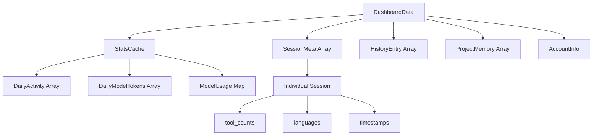

## Overview

All TypeScript interfaces are defined in `src/lib/types.ts`. The data model represents Claude Code usage analytics, parsed from various JSON and JSONL files in the `~/.claude/` directory.

## Core Types

### DashboardData

Root data structure passed from server/upload to the dashboard.

```typescript title="src/lib/types.ts"
export interface DashboardData {
  stats: StatsCache | null;
  sessions: SessionMeta[];
  history: HistoryEntry[];
  memories: ProjectMemory[];
  account?: AccountInfo;
  exportedAt?: string;
}
```

<ParamField path="stats" type="StatsCache | null">
  Pre-aggregated statistics from `stats-cache.json`. May be `null` if cache doesn't exist.
</ParamField>

<ParamField path="sessions" type="SessionMeta[]">
  Array of per-session metadata objects, sorted by `start_time` descending
</ParamField>

<ParamField path="history" type="HistoryEntry[]">
  Prompt history from `history.jsonl`
</ParamField>

<ParamField path="memories" type="ProjectMemory[]">
  Project memory files with content (up to 5000 chars per file)
</ParamField>

<ParamField path="account" type="AccountInfo" optional>
  Account identifiers extracted during export. Only present in uploaded files.
</ParamField>

<ParamField path="exportedAt" type="string" optional>
  ISO timestamp when export was created. Only present in uploaded files.
</ParamField>

---

### StatsCache

Pre-aggregated statistics computed by Claude Code itself. This data cannot be derived from session metadata alone.

```typescript title="src/lib/types.ts"
export interface StatsCache {
  totalSessions: number;
  totalMessages: number;
  firstSessionDate: string;
  dailyActivity: DailyActivity[];
  dailyModelTokens: DailyModelTokens[];
  modelUsage: Record<string, ModelUsage>;
  hourCounts: Record<string, number>;
  longestSession: {
    sessionId: string;
    duration: number;
    messageCount: number;
    timestamp: string;
  };
  version?: string;
  lastComputedDate?: string;
}
```

<ResponseField name="totalSessions" type="number">
  Total number of sessions recorded
</ResponseField>

<ResponseField name="totalMessages" type="number">
  Total messages across all sessions (user + assistant)
</ResponseField>

<ResponseField name="firstSessionDate" type="string">
  ISO date string of the first recorded session (e.g., `"2025-01-15"`)
</ResponseField>

<ResponseField name="dailyActivity" type="DailyActivity[]">
  Daily breakdown of activity metrics
</ResponseField>

<ResponseField name="dailyModelTokens" type="DailyModelTokens[]">
  Daily token usage by model
</ResponseField>

<ResponseField name="modelUsage" type="Record<string, ModelUsage>">
  Per-model token breakdown and costs. Keys are model names like `"claude-3-7-sonnet-20250219"`
</ResponseField>

<ResponseField name="hourCounts" type="Record<string, number>">
  Sessions per hour of day. Keys are "0" through "23"
</ResponseField>

<ResponseField name="longestSession" type="object">
  Metadata about the longest session by duration
  
  <Expandable title="properties">
    <ResponseField name="sessionId" type="string">
      Unique session identifier
    </ResponseField>
    <ResponseField name="duration" type="number">
      Duration in milliseconds
    </ResponseField>
    <ResponseField name="messageCount" type="number">
      Total messages in the session
    </ResponseField>
    <ResponseField name="timestamp" type="string">
      ISO timestamp when session started
    </ResponseField>
  </Expandable>
</ResponseField>

<ResponseField name="version" type="string" optional>
  Cache format version
</ResponseField>

<ResponseField name="lastComputedDate" type="string" optional>
  When stats cache was last computed
</ResponseField>

---

### SessionMeta

Per-session metadata from `~/.claude/usage-data/session-meta/*.json`.

```typescript title="src/lib/types.ts"
export interface SessionMeta {
  session_id: string;
  project_path: string;
  start_time: string;
  duration_minutes: number;
  user_message_count: number;
  assistant_message_count: number;
  tool_counts: Record<string, number>;
  languages: Record<string, number>;
  git_commits: number;
  git_pushes: number;
  input_tokens: number;
  output_tokens: number;
  first_prompt: string;
  user_interruptions: number;
  tool_errors: number;
  tool_error_categories: Record<string, number>;
  uses_task_agent: boolean;
  uses_mcp: boolean;
  uses_web_search: boolean;
  uses_web_fetch: boolean;
  lines_added: number;
  lines_removed: number;
  files_modified: number;
  message_hours: number[];
  user_message_timestamps: number[];
}
```

<ParamField path="session_id" type="string">
  Unique identifier for the session
</ParamField>

<ParamField path="project_path" type="string">
  Absolute path to the project directory (e.g., `/Users/john/projects/my-app`)
</ParamField>

<ParamField path="start_time" type="string">
  ISO timestamp when session started
</ParamField>

<ParamField path="duration_minutes" type="number">
  Session duration in minutes
</ParamField>

<ParamField path="user_message_count" type="number">
  Number of messages sent by the user
</ParamField>

<ParamField path="assistant_message_count" type="number">
  Number of messages sent by Claude
</ParamField>

<ParamField path="tool_counts" type="Record<string, number>">
  Tool usage counts by tool name (e.g., `{"Read": 42, "Edit": 15}`)
</ParamField>

<ParamField path="languages" type="Record<string, number>">
  Language usage by line count (e.g., `{"TypeScript": 200, "CSS": 50}`)
</ParamField>

<ParamField path="git_commits" type="number">
  Number of git commits made during session
</ParamField>

<ParamField path="git_pushes" type="number">
  Number of git pushes during session
</ParamField>

<ParamField path="input_tokens" type="number">
  Total input tokens consumed
</ParamField>

<ParamField path="output_tokens" type="number">
  Total output tokens generated
</ParamField>

<ParamField path="first_prompt" type="string">
  The first prompt text from the session
</ParamField>

<ParamField path="user_interruptions" type="number">
  Times user interrupted Claude's response
</ParamField>

<ParamField path="tool_errors" type="number">
  Number of tool execution errors
</ParamField>

<ParamField path="tool_error_categories" type="Record<string, number>">
  Error counts by category
</ParamField>

<ParamField path="uses_task_agent" type="boolean">
  Whether session used task agents
</ParamField>

<ParamField path="uses_mcp" type="boolean">
  Whether session used MCP (Model Context Protocol)
</ParamField>

<ParamField path="uses_web_search" type="boolean">
  Whether session used web search
</ParamField>

<ParamField path="uses_web_fetch" type="boolean">
  Whether session used web fetch
</ParamField>

<ParamField path="lines_added" type="number">
  Total lines of code added
</ParamField>

<ParamField path="lines_removed" type="number">
  Total lines of code removed
</ParamField>

<ParamField path="files_modified" type="number">
  Number of files modified
</ParamField>

<ParamField path="message_hours" type="number[]">
  Array of hours (0-23) when messages were sent
</ParamField>

<ParamField path="user_message_timestamps" type="number[]">
  Unix timestamps (milliseconds) of user messages
</ParamField>

---

### DailyActivity

Daily activity metrics for the heatmap visualization.

```typescript
export interface DailyActivity {
  date: string;           // ISO date "YYYY-MM-DD"
  messageCount: number;
  sessionCount: number;
  toolCallCount: number;
}
```

---

### DailyModelTokens

Daily token consumption by model.

```typescript
export interface DailyModelTokens {
  date: string;                          // ISO date "YYYY-MM-DD"
  tokensByModel: Record<string, number>; // Model name → total tokens
}
```

---

### ModelUsage

Token and cost breakdown for a single model.

```typescript
export interface ModelUsage {
  inputTokens: number;
  outputTokens: number;
  cacheReadInputTokens: number;
  cacheCreationInputTokens: number;
  webSearchRequests: number;
  costUSD?: number;
  contextWindow?: number;
  maxOutputTokens?: number;
}
```

<ParamField path="inputTokens" type="number">
  Total input tokens consumed
</ParamField>

<ParamField path="outputTokens" type="number">
  Total output tokens generated
</ParamField>

<ParamField path="cacheReadInputTokens" type="number">
  Tokens read from cache (reduced cost)
</ParamField>

<ParamField path="cacheCreationInputTokens" type="number">
  Tokens used to create cache entries
</ParamField>

<ParamField path="webSearchRequests" type="number">
  Number of web search requests made
</ParamField>

<ParamField path="costUSD" type="number" optional>
  Total cost in USD for this model
</ParamField>

<ParamField path="contextWindow" type="number" optional>
  Model's context window size
</ParamField>

<ParamField path="maxOutputTokens" type="number" optional>
  Model's maximum output token limit
</ParamField>

---

### HistoryEntry

Single prompt from `~/.claude/history.jsonl`.

```typescript
export interface HistoryEntry {
  display: string;
  pastedContents: Record<string, unknown>;
  timestamp: number;
  project: string;
}
```

<ParamField path="display" type="string">
  The prompt text as displayed in the UI
</ParamField>

<ParamField path="pastedContents" type="Record<string, unknown>">
  Any content pasted along with the prompt
</ParamField>

<ParamField path="timestamp" type="number">
  Unix timestamp in milliseconds
</ParamField>

<ParamField path="project" type="string">
  Project path where prompt was used
</ParamField>

---

### ProjectMemory

Memory files from `~/.claude/projects/<id>/memory/`.

```typescript
export interface ProjectMemory {
  project: string;
  files: { name: string; content: string }[];
}
```

<ParamField path="project" type="string">
  Encoded project directory name (slashes replaced with dashes)
</ParamField>

<ParamField path="files" type="array">
  Array of memory files
  
  <Expandable title="File object">
    <ParamField path="name" type="string">
      Filename (e.g., `"MEMORY.md"`)
    </ParamField>
    <ParamField path="content" type="string">
      File content, truncated to 5000 characters
    </ParamField>
  </Expandable>
</ParamField>

---

### AccountInfo

Account identifiers extracted from Statsig cache during export.

```typescript
export interface AccountInfo {
  accountUUID?: string;
  organizationUUID?: string;
  appVersion?: string;
}
```

<ParamField path="accountUUID" type="string" optional>
  Unique account identifier
</ParamField>

<ParamField path="organizationUUID" type="string" optional>
  Organization identifier (for team accounts)
</ParamField>

<ParamField path="appVersion" type="string" optional>
  Claude Code application version
</ParamField>

---

### SessionMessage

Individual message from a session transcript, loaded via API route.

```typescript
export interface SessionMessage {
  role: "user" | "assistant";
  text: string;
  timestamp: string;
  toolUse?: { name: string; id: string }[];
}
```

<ParamField path="role" type="'user' | 'assistant'">
  Message sender
</ParamField>

<ParamField path="text" type="string">
  Message content, truncated to 5000 characters
</ParamField>

<ParamField path="timestamp" type="string">
  ISO timestamp when message was sent
</ParamField>

<ParamField path="toolUse" type="array" optional>
  Tools used in this message (assistant messages only)
  
  <Expandable title="Tool object">
    <ParamField path="name" type="string">
      Tool name (e.g., `"Read"`, `"Edit"`)
    </ParamField>
    <ParamField path="id" type="string">
      Unique tool use ID
    </ParamField>
  </Expandable>
</ParamField>

## Data Relationships



<Info>
  **Aggregation Flow**: Raw session data (`SessionMeta[]`) is aggregated into `StatsCache` by Claude Code. The analytics app consumes both to provide comprehensive insights.
</Info>

## Export JSON Format

The `scripts/export.mjs` script produces a single JSON file:

```json
{
  "stats": {
    "totalSessions": 342,
    "totalMessages": 8451,
    "firstSessionDate": "2025-01-15",
    "dailyActivity": [...],
    "dailyModelTokens": [...],
    "modelUsage": {...},
    "hourCounts": {...},
    "longestSession": {...}
  },
  "sessions": [
    {
      "session_id": "abc123",
      "project_path": "/Users/john/project",
      "start_time": "2026-03-04T10:00:00Z",
      "duration_minutes": 45,
      ...
    }
  ],
  "history": [...],
  "memories": [
    {
      "project": "-Users-john-project",
      "files": [
        {
          "name": "MEMORY.md",
          "content": "# Project Context\n..."
        }
      ]
    }
  ],
  "account": {
    "accountUUID": "550e8400-e29b-41d4-a716-446655440000",
    "organizationUUID": "...",
    "appVersion": "1.2.3"
  },
  "exportedAt": "2026-03-04T12:00:00.000Z"
}
```

## Source Files on Disk

<CardGroup cols={2}>
  <Card title="stats-cache.json" icon="database">
    Pre-aggregated statistics
    
    **Location**: `~/.claude/stats-cache.json`
    
    **Format**: JSON
  </Card>
  
  <Card title="session-meta/*.json" icon="folder">
    Per-session metadata files
    
    **Location**: `~/.claude/usage-data/session-meta/`
    
    **Format**: One JSON file per session
  </Card>
  
  <Card title="history.jsonl" icon="list">
    Prompt history
    
    **Location**: `~/.claude/history.jsonl`
    
    **Format**: Newline-delimited JSON
  </Card>
  
  <Card title="memory/*.md" icon="brain">
    Project memory files
    
    **Location**: `~/.claude/projects/<id>/memory/`
    
    **Format**: Markdown
  </Card>
  
  <Card title="<session>.jsonl" icon="messages">
    Full session transcripts
    
    **Location**: `~/.claude/projects/<id>/`
    
    **Format**: Newline-delimited JSON
  </Card>
  
  <Card title="statsig cache" icon="settings">
    Account information
    
    **Location**: `~/.claude/statsig/`
    
    **Format**: JSON (read during export only)
  </Card>
</CardGroup>

## Backward Compatibility

The upload zone (`upload-zone.tsx`) handles old export formats:

<Check>Auto-normalizes old memory format where `files` contained plain strings instead of `{name, content}` objects</Check>

<Check>Gracefully handles missing `account` and `exportedAt` fields</Check>

<Check>Validates JSON structure before processing</Check>

```tsx title="Memory Format Normalization"
// Normalize old memory format (string[] → {name, content}[])
for (const mem of data.memories) {
  if (mem.files?.length && typeof mem.files[0] === "string") {
    mem.files = (mem.files as unknown as string[]).map((f) => ({
      name: f,
      content: "",
    }));
  }
}
```